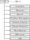

# Initialization module

CT built-in functions are written to perform fast parametric studies, thus the data passed between the functions has been organized in a hierarchical tree structure (except for the GUI which is based on OOP) as shown in Fig.1, namely:
   * `self (App)`: parent node; contains all the data of the code, e.g., databases, input values, and results.
   * `Constants (C)`: contains constant values.
   * `Elements (E)`: contains data of the chemical elements in the problem (names and indices for fast data access).
   * `Species (S)`: contains data of the chemical species in the problem (names and indices for fast data access), as well as lists (cells) with the species for complete combustion.
   * `Problem Description (PD)`: contains data of the problem to solve, e.g., initial mixture (composition, temperature, pressure), problem type, and its configuration.
   * `Problem Solution (PS)`: contains results (mixtures).
   * `Tuning Properties (TN)`: contains parameters that control the numerical error of the algorithms implemented in the different modules.
   * `Miscellaneous (Misc)`: contains values that configure the auto-generated plots and export setup, as well as flags, e.g., setting <tt>FLAG\_RESULTS = true</tt> (by default) the results are shown in the command window (only in the desktop environment).
   * `Database master (DB_master)`: a structured thermochemical database including data from {cite:t}`Mcbride2002, burcat2005`.
   * `Database (DB)`: a structured thermochemical database with *griddedInterpolant* objects (see MATLAB built-in function <tt>griddedInterpolant.m</tt>) that contain piecewise cubic Hermite interpolating polynomials (PCHIP) {cite:p}`fritsch1980` for faster data access. 

   <br>
   
<p align="center">
    
</p>

```{eval-rst}
.. only:: latex

    .. image:: ../../../_static/img/cuadra2022/sketch_tree_structure.pdf
        :width: 150px
        :align: center
```

**Figure 1:** *Combustion Toolbox hierarchical data tree structure, where* <tt> `App.m` </tt> *is the initialization function.*

## App

Routines to initialize the Combustion Toolbox.

***

:::{dropdown} Routines
```{eval-rst}
.. automodule:: src.modules.self.App
    :members:
```
:::

## Constants

Routines to initialize the Constants branch in the self variable (struct).

***

:::{dropdown} Routines
```{eval-rst}
.. automodule:: src.modules.self.Constants
   :members:
```
:::

## Elements

Routines to initialize the Elements branch in the self variable (struct).

***

:::{dropdown} Routines
```{eval-rst}
.. automodule:: src.modules.self.Elements
   :members:
```
:::

## Miscellaneous

Routines to initialize the Miscellaneous branch in the self variable (struct).

***

:::{dropdown} Routines
```{eval-rst}
.. automodule:: src.modules.self.Miscellaneous
   :members:
```
:::

## ProblemDescription

Routines to initialize the ProblemDescription branch in the self variable (struct).

***

:::{dropdown} Routines
```{eval-rst}
.. automodule:: src.modules.self.ProblemDescription
   :members:
```
:::

## ProblemSolution

Routines to initialize the ProblemSolution branch in the self variable (struct).

***

:::{dropdown} Routines
```{eval-rst}
.. automodule:: src.modules.self.ProblemSolution
   :members:
```
:::

## Species

Routines to initialize the Species branch in the self variable (struct).

***

:::{dropdown} Routines
```{eval-rst}
.. automodule:: src.modules.self.Species
   :members:
```
:::

## TuningProperties

Routines to initialize the TuningProperties branch in the self variable (struct).

***

:::{dropdown} Routines
```{eval-rst}
.. automodule:: src.modules.self.TuningProperties
   :members:
```
:::