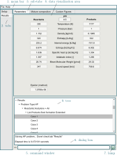
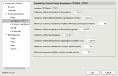
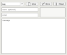

# GUI

Routines to generate the app, add-ons, assets, and all the necessary functions to be compatible with the plain code and extend its functionality.

## Combustion Toolbox GUI

<p align="center">
    
</p>

**Figure 1:** *Post-process of results using the GUI of the adiabatic combustion for a lean-to-rich acetylene (C2H2)-air mixture at standard conditions (T1 = 300 K and p1 = 1 atm); labels: name of the different components of the GUI. In particular, the numerical results correspond to phi = 0.5 (selected case in the tree component) [part 1].*


<p align="center">
    
</p>

**Figure 2:** *Post-process of results using the GUI of the adiabatic combustion for a lean-to-rich acetylene (C2H2)-air mixture at standard conditions (T1 = 300 K and p1 = 1 atm); labels: name of the different components of the GUI. In particular, the numerical results correspond to phi = 0.5 (selected case in the tree component) [part 2].*

<p align="center">
    
</p>

**Figure 3:** *Post-process of results using the GUI of the adiabatic combustion for a lean-to-rich acetylene (C2H2)-air mixture at standard conditions (T1 = 300 K and p1 = 1 atm); labels: name of the different components of the GUI. In particular, the numerical results correspond to phi = 0.5 (selected case in the tree component) [part 3].*

:::{dropdown} Routines
```{eval-rst}
.. automodule:: src.gui
   :members:
```
:::

## Utility functions

A collection of functions for Combustion Toolbox GUI.

***

:::{dropdown} Routines
```{eval-rst}
.. automodule:: src.gui.utils
   :members:
```
:::

## Add-ons

The Add-ons included in CT are:
* ```uielements```: to select and analyse the species in the database. The species from Third Millenium Database [1] are denoted with suffix _M (see Fig. 1).
* ```uipreferences```: to set all the preferences of Combustion Toolbox (see Fig. 2).
* ```uifeedback```: to report bug/inquiries of Combustion Toolbox (see Fig. 3).
* ```uivalidations```: to reproduce all the validations of Combustion Toolbox (see Fig. 4).
* ```uiabout```: to know who are the developers and get useful links (see Fig. 5).

<br>

<p align="center">
    
</p>

**Figure 1:** *Add-on uielements.*

<p align="center">
    
</p>

**Figure 2:** *Add-on uipreferences.*

<p align="center">
    
</p>

**Figure 3:** *Add-on uifeedback.*

<p align="center">
    
</p>

**Figure 4:** *Add-on uivalidations.*

<p align="center">
    
</p>

**Figure 5:** *Add-on uiabout.*

***

:::{dropdown} Routines
```{eval-rst}
.. automodule:: src.gui.addons
   :members:
```
:::

1. Burcat, A., & Ruscic, B. (2005). Third millenium ideal gas and condensed phase thermochemical database for combustion (with update from active thermochemical tables) (No. ANL-05/20). Argonne National Lab.(ANL), Argonne, IL (United States).