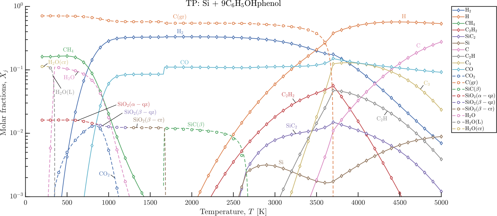

<!-- Logo -->

    

    

<!-- Intro -->
  
 <b> A modular MATLAB-based framework for solving combustion and high-speed flow problems, with integrated support for caloric models and linear shock-turbulence interaction analysis.
</b> 
  

    

    

<!-- Grid -->
::::{grid} 1 1 1 3
:margin: 4 4 0 0
:gutter: 1

:::{grid-item-card} {octicon}`package` Robust modular kernel
:link: https://combustion-toolbox-website.readthedocs.io/en/latest/documentation/api/equilibrium/index.html
`Robust`, `object-oriented`, and `fast` chemical equilibrium computations.
:::

:::{grid-item-card} {octicon}`device-desktop` Interactive App
:link: https://github.com/AlbertoCuadra/combustion_toolbox/archive/refs/heads/master.zip
The code is encapsulated in a `user-friendly` GUI with tons of capabilities.
:::

:::{grid-item-card} {octicon}`globe` Open source
:link: https://github.com/AlbertoCuadra/combustion_toolbox
Completely open source, GUI included! 
{bdg-light}`GitHub` {bdg-info}`GPLv3`
:::

::::

# Combustion Toolbox in action

    &nbsp;
    

<!--

# Combustion Toolbox capabilities

::::{grid} 1 2 2 2
:margin: 4 4 0 0
:gutter: 1

:::{grid-item-card} {octicon}`cpu` Robust chemical equilibrium computations
:link: https://combustion-toolbox-website.readthedocs.io/en/latest/documentation/api/equilibrium/index.html

{bdg-light}`TP` {bdg-light}`HP` {bdg-light}`SP` {bdg-light}`TV` {bdg-light}`EV` {bdg-light}`SV` {bdg-light}`frozen` {bdg-light}`plasma state`

:::

:::{grid-item-card} {octicon}`device-desktop` Interactive App
:link: https://github.com/AlbertoCuadra/combustion_toolbox/archive/refs/heads/master.zip
Over 10K lines of code encapsulated in a `user-friendly` GUI with tons of capabilities.
{bdg-light}`Toolbox` {bdg-light}`Standalone (royalty-free)`
:::

:::{grid-item-card} {octicon}`tab` Shocks and detonations pre- and post-shock states 
:link: https://combustion-toolbox-website.readthedocs.io/en/latest/documentation/api/shockdetonation/index.html
{bdg-light}`Incident` {bdg-light}`Reflected` {bdg-light}`Oblique` {bdg-light}`Shock polar` {bdg-light}`Detonations polar` {bdg-light}`Regular Reflections` 
:::

:::{grid-item-card} {octicon}`globe` Open source
:link: https://github.com/AlbertoCuadra/combustion_toolbox
Completely open source, GUI included!
{bdg-light}`GitHub` {bdg-light}`FileExchange` {bdg-light}`Zenodo` {bdg-info}`GPLv3`
:::

::::

::::{grid} 1 2 2 3
:margin: 4 4 0 0
:gutter: 1

:::{grid-item-card} {octicon}`rocket` Rocket propellant performance
:link: https://combustion-toolbox-website.readthedocs.io/en/latest/documentation/api/rocket/index.html
{bdg-light}`Infinite-Chamber-Area` {bdg-light}`Finite-Chamber-Area`
:::

:::{grid-item-card} {octicon}`server` Extensive database with NASA’s 9-coefficient polynomial fits up to 20000 K
:link: https://combustion-toolbox-website.readthedocs.io/en/latest/documentation/api/databases/index.html
{bdg-light}`NASA` {bdg-light}`Burcat` {bdg-light}`ATcT`
:::

:::{grid-item-card} {octicon}`verified` Excellent agreement with `NASA's CEA`, `Cantera`, `Caltech's SD-Toolbox`, and `TEA`
:link: https://combustion-toolbox-website.readthedocs.io/en/latest/validations.html
:::

:::{grid-item-card} {octicon}`graph` Predefined plots
:link: https://combustion-toolbox-website.readthedocs.io/en/latest/documentation/api/utils/index.html#display-functions
:::

:::{grid-item-card} {octicon}`download` Export results
:link: https://combustion-toolbox-website.readthedocs.io/en/latest/documentation/api/utils/index.html#export-functions
{bdg-light}`.xls` {bdg-light}`.mat`
:::

:::{grid-item-card} {octicon}`versions` Compatible
:link: https://github.com/AlbertoCuadra/combustion_toolbox
{bdg-light}`Windows` {bdg-light}`Linux` {bdg-light}`Mac`
:::

::::

-->

The Combustion Toolbox {cite:p}`cuadra2026a` is a MATLAB-based thermochemical framework designed to solve problems involving chemical equilibrium for both gas- and condensed-phase species. The toolbox is composed of several modules, each of which is designed to solve a specific class of problems:

- **CT-EQUIL** computes the thermochemical equilibrium composition of multi-component gas mixtures for prescribed set of chemical species (gaseous—including ions—or condensed phases) and thermodynamic constraints (e.g. pressure–enthalpy).
- **CT-SD** solves steady-state shock and detonation wave problems for both normal and oblique incidence.  
- **CT-ROCKET** estimates the theoretical performance of rocket engines under highly idealized conditions.
- **CT-LIA** predicts shock-turbulence interaction statistics using linear theory, accounting for thermochemical effects.
- **CT-TURBULENCE** performs spectral and statistical analysis of turbulent flows, including energy spectra, Helmholtz decomposition, and turbulence diagnostics.

The framework also includes an intuitive **graphical user interface (GUI)**, with a **royalty-free standalone version** available for Windows, macOS, and Linux.

There is a sixth closed-source (i.e., proprietary) module, CT-EXPLO, that estimates the theoretical properties of high explosive mixtures and multi-component propellants with non-ideal EoS. Although still under development, CT-EXPLO is distributed in its current form as the thermochemical module of SimEx {cite:p}`simex2022` subject to a proprietary license. Further details on this module will be provided elsewhere. 

# Start here!

::::{grid} 1 2 2 3
:margin: 4 4 0 0
:gutter: 1

:::{grid-item-card} {octicon}`tasklist` Tutorials
:link: https://combustion-toolbox-website.readthedocs.io/en/latest/tutorials.html

New to Combustion Toolbox?
:::

:::{grid-item-card} {octicon}`note` Examples
:link: https://combustion-toolbox-website.readthedocs.io/en/latest/examples.html

See how the toolbox can be used in practical scenarios.
:::

:::{grid-item-card} {octicon}`repo` API Documentation
:link: https://combustion-toolbox-website.readthedocs.io/en/latest/documentation/api/index.html

Let's check the documentation of almost (every) functions.
:::

::::

# Gallery

Here we show some results obtained using the Combustion Toolbox.

    

    

**Figure 1:** *Variation of the molar fractions $X_j$ for a TP transformation of a Silica-Phenolic mixture at atmospheric pressure $(p = 1$ atm$)$ with $T \in [200, 5000]$; line: numerical results obtained with CT; symbols: numerical results obtained with NASA's CEA {cite:p}`gordon1994`.*

    

    

**Figure 2:** *Hugoniot curves for different molecular gases at pre-shock temperature $T_1 = 300$ K and pressure $p_{1} = 1$ atm \[numerical results obtained with Combustion Toolbox (lines) and contrasted with NASA’s Chemical Equilibrium with Applications (CEA) code {cite:p}`gordon1994` excluding ionization (symbols)\]*.

    

    

**Figure 3:** *Variation of molar fraction for a CJ detonation for lean to rich CH4-air mixtures at standard conditions $(T_1 = 300$ K and pressure $p_1 = 1$ atm$)$; line: numerical results obtained with Combustion Toolbox; circles: NASA's Chemical Equilibrium with Applications code {cite:p}`gordon1994`. The computational time was of 6.68 seconds using a Intel(R) Core(TM) i7-8700 CPU @ 3.20GHz for a set of 26 species considered and a total of 351 case studies.*

    

    

**Figure 4:** *Pressure-deflection (a) and wave angle-deflection (b) shock polar diagrams for air (79\% N2, 21\% O2) at pre-shock temperature $T_1 = 300$ K and pressure $p_1 = 1$ atm, and a range of pre-shock Mach numbers M1 between 2 and 14; line: calorically imperfect gas with ionization/dissociation; dashed: calorically imperfect gas with frozen chemistry; circles: results obtained with Cantera {cite:p}`cantera` within Caltech’s SD-Toolbox {cite:p}`Browne2008SDT, Browne2008`; diamonds: maximum deflection angle* $\theta_{\rm max}$.