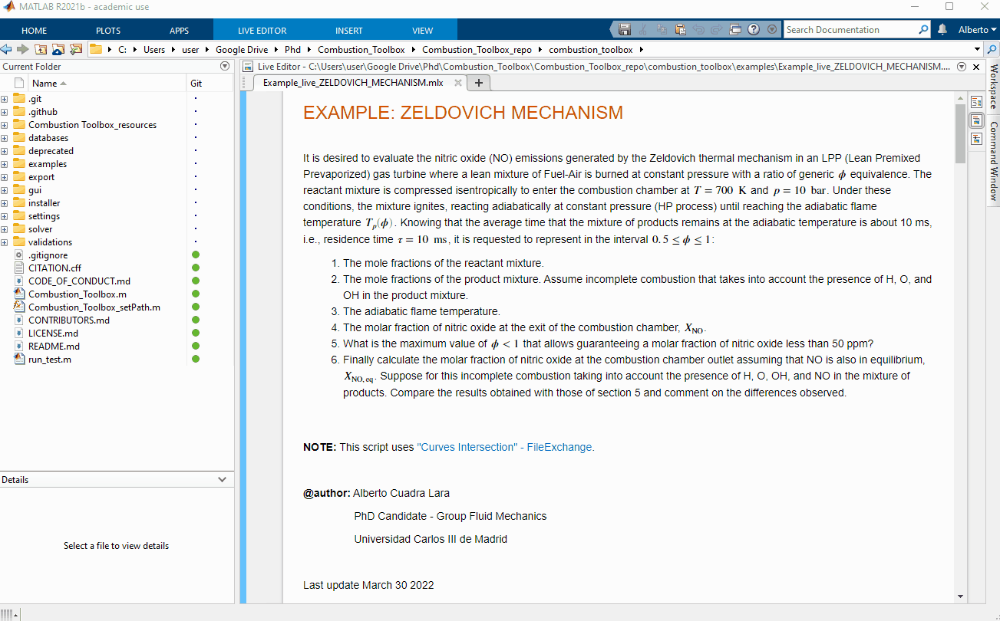

# Quickstart

Combustion toolbox can be used in two ways:
* Using the MATLAB's desktop environment to obtain all the versatility of the plain code.
* Using the Graphical User Interface (GUI) and forget about code.

**1.** Download the code from one of the following repositories:

<!-- * [Github](https://github.com/AlbertoCuadra/combustion_toolbox)
* [FileExchange](https://in.mathworks.com/matlabcentral/fileexchange/101088-combustion-toolbox?requestedDomain=)
* [Zenodo](https://zenodo.org/record/6383180) -->

<!-- <object type="image/svg+xml" data="img/icon_github.svg" class="github" > </object> -->

::::{grid} 1 2 2 3
:margin: 4 4 0 0
:gutter: 1
                
:::{grid-item-card} <svg stroke="currentColor" fill="currentColor" stroke-width="0" viewBox="0 0 16 16" width="200px" height="200px"> <path fill-rule="evenodd" d="M8 0C3.58 0 0 3.58 0 8c0 3.54 2.29 6.53 5.47 7.59.4.07.55-.17.55-.38 0-.19-.01-.82-.01-1.49-2.01.37-2.53-.49-2.69-.94-.09-.23-.48-.94-.82-1.13-.28-.15-.68-.52-.01-.53.63-.01 1.08.58 1.23.82.72 1.21 1.87.87 2.33.66.07-.52.28-.87.51-1.07-1.78-.2-3.64-.89-3.64-3.95 0-.87.31-1.59.82-2.15-.08-.2-.36-1.02.08-2.12 0 0 .67-.21 2.2.82.64-.18 1.32-.27 2-.27.68 0 1.36.09 2 .27 1.53-1.04 2.2-.82 2.2-.82.44 1.1.16 1.92.08 2.12.51.56.82 1.27.82 2.15 0 3.07-1.87 3.75-3.65 3.95.29.25.54.73.54 1.48 0 1.07-.01 1.93-.01 2.2 0 .21.15.46.55.38A8.013 8.013 0 0 0 16 8c0-4.42-3.58-8-8-8z"></path> </svg> Github
:link: https://github.com/AlbertoCuadra/combustion_toolbox
:::

:::{grid-item-card} 

 MATLAB FileExchange
:link: https://in.mathworks.com/matlabcentral/fileexchange/101088-combustion-toolbox?requestedDomain=
:::

:::{grid-item-card} 

 Zenodo
:link: https://zenodo.org/record/6396748
:::

::::

**2.** Open MATLAB with the path set to the downloaded folder

**3.** To install the GUI execute `combustion_toolbox_app.mlappinstall` in the installer folder. As simple as that.

    

Combustion Toolbox GUI can also be used with the MATLAB's standalone version. In this case, proceed running `combustion_toolbox_standalone_installer.exe`.

To use the desktop environment (plain code) along with the GUI install the package from `combustion_toolbox_package.mltbx` or running `INSTALL.m`.