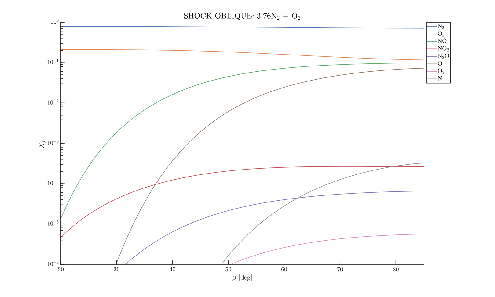
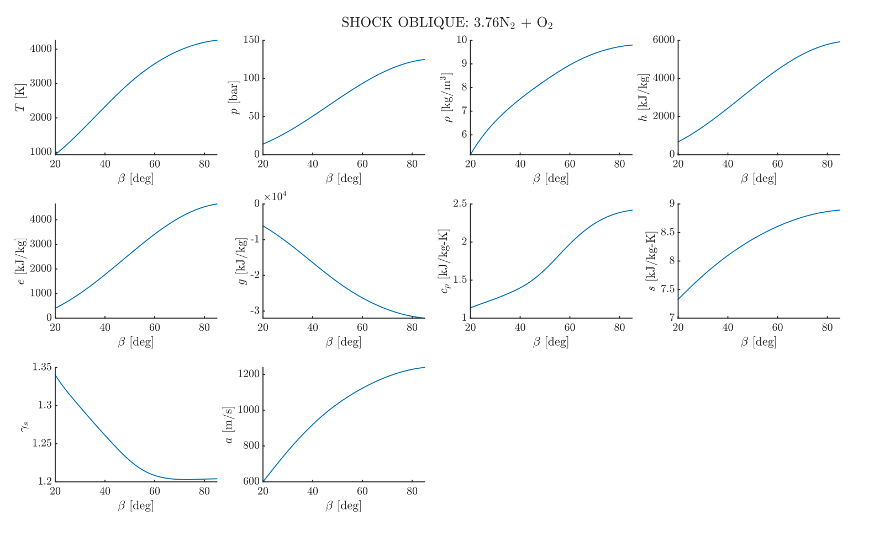
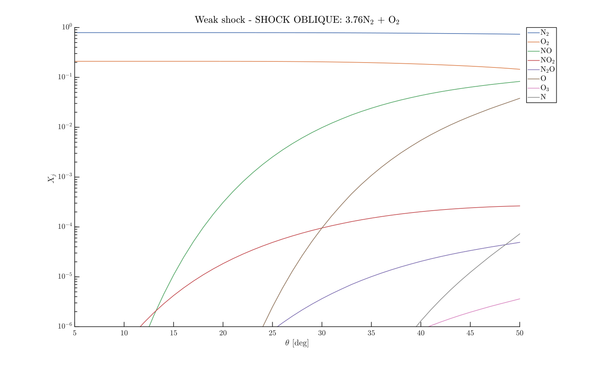
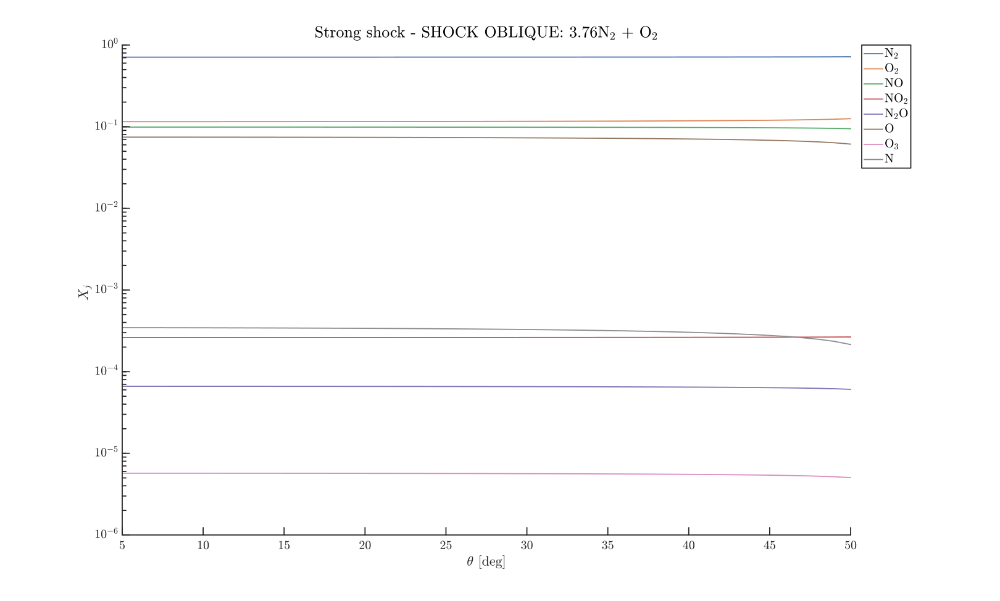
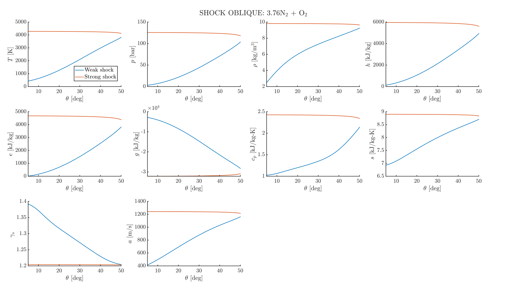

# Oblique shock waves

This tutorial extends the analysis of [normal shock waves](./shock_waves_1.md) to the case of oblique shocks, where the shock front is inclined relative to the incoming supersonic flow. In this configuration, the post-shock state can be determined by prescribing either the shock wave angle $\beta$ or the flow deflection angle $\theta$, as illustrated below:

<p align="center">
    
</p>

The governing Rankine–Hugoniot relations remain the same as for normal shocks, but it is convenient to write them in terms of the normal component of the upstream velocity:
```{eval-rst}
.. math::
    :nowrap:

    \begin{equation}
      p_2 = p_1 + \rho_1 u_{n,1}^2 \left( 1-\dfrac{\rho_1}{\rho_2}\right) \quad \text{and} \quad 
      h_2 = h_1 + \dfrac{u_{n,1}^2}{2}\left[1- \left(\dfrac{\rho_1}{\rho_2}\right)^2\right],
    \end{equation}
```
with $u_{n,1} = \mathcal{M}_1 a_1 \sin\beta$, where $u_{n,1}$ is the normal component of the upstream velocity, $\mathcal{M}_1$ the upstream Mach number, and $a_1$ the upstream speed of sound. 

The wave angle $\beta$ and flow deflection angle $\theta$ are related through the oblique-shock trigonometric condition derived from tangential momentum conservation ($u_{1,t} = u_{2,t}$):
```{eval-rst}
.. math::
    :nowrap:

    \begin{equation}
       \tan(\beta - \theta) = \frac{u_{2,n}}{u_{1,n}} \tan\beta
    \end{equation}
```
where $u_{2,n} = u_2 \sin(\beta - \theta)$ is the downstream velocity component normal to the shock, and $u_{2,t}$ the tangential component.

If the wave angle $\beta$ is specified, the RH equations give a unique solution. However, if the deflection angle $\theta$ is given, two solutions generally exist:
* **Weak solution** (smaller $\beta$): the downstream flow remains supersonic.
* **Strong solution** (larger $\beta$): the downstream flow becomes subsonic.
These two branches meet at the maximum deflection angle $\theta_{\max}$, above which no physical solution exists for a given upstream Mach number $\mathcal{M}_1$. In practice, the weak-shock branch is usually observed in external aerodynamic flows, while the strong-shock branch is less common.

```````{tab-set}
``````{tab-item} Wave angle $\beta$
As for the normal shock case, we employ the {mat:func}`~src.+combustiontoolbox.+shockdetonation.@ShockSolver.ShockSolver`  class, part of the `+combustiontoolbox.+shockdetonation` (CT-SD) subpackage (module). Below is an example that solves the Rankine-Hugoniot equations for a planar oblique incident shock wave in air (79% $\text{N}_2$, 21% $\text{O}_2$ by volume), with an initial temperature $T_1 = 300$ K, pressure $p_1 = 1$ bar, pre-shock Mach number $\mathcal{M}_1 = 10$, and wave angle $\beta = 20:1:85$ degrees:

```matlab
% Import packages
import combustiontoolbox.databases.NasaDatabase
import combustiontoolbox.core.*
import combustiontoolbox.shockdetonation.ShockSolver

% Get NASA's database
DB = NasaDatabase();

% Define chemical system
system = ChemicalSystem(DB);

% Initialize mixture
mix = Mixture(system);

% Define chemical state
set(mix, {'N2', 'O2'}, [79/21, 1]);

% Define properties
mixArray1 = setProperties(mix, 'temperature', 300, 'pressure', 1, 'Mach', 10, 'beta', 20:1:85);

% Initialize shock solver
solver = ShockSolver();

% Perform shock calculations
[mixArray1, mixArray2] = solveArray(solver, mixArray1);

% Generate report
report(solver, mixArray1, mixArray2);
```

This code snippet will generate two figures: Molar fraction of species in the mixture as a function of the wave angle $\beta$ and the variation of the thermodynamic properties (e.g., temperature, pressure) as a function of $\beta$.

<p align="center">
    
</p>

<p align="center">
    
</p>

``````

``````{tab-item} Deflection angle $\theta$
As for the normal shock case, we employ the {mat:func}`~src.+combustiontoolbox.+shockdetonation.@ShockSolver.ShockSolver`  class, part of the `+combustiontoolbox.+shockdetonation` (CT-SD) subpackage (module). Below is an example that solves the Rankine-Hugoniot equations for a planar oblique incident shock wave in air (79% $\text{N}_2$, 21% $\text{O}_2$ by volume), with an initial temperature $T_1 = 300$ K, pressure $p_1 = 1$ bar, pre-shock Mach number $\mathcal{M}_1 = 10$, and theta angle $\theta = 5:1:50$ degrees:


```matlab
% Import packages
import combustiontoolbox.databases.NasaDatabase
import combustiontoolbox.core.*
import combustiontoolbox.shockdetonation.ShockSolver

% Get NASA's database
DB = NasaDatabase();

% Define chemical system
system = ChemicalSystem(DB);

% Initialize mixture
mix = Mixture(system);

% Define chemical state
set(mix, {'N2', 'O2'}, [79/21, 1]);

% Define properties
mixArray1 = setProperties(mix, 'temperature', 300, 'pressure', 1, 'Mach', 10, 'theta', 5:1:50);

% Initialize shock solver
solver = ShockSolver();

% Perform shock calculations
[mixArray1, mixArray2_1, mixArray2_2] = solveArray(solver, mixArray1);

% Generate report
report(solver, mixArray1, mixArray2_1, mixArray2_2);
```

This code snippet will generate three figures: Molar fraction of species in the mixture as a function of the deflection angle $\theta$ for the weak and strong solutions, as well as the variation of the thermodynamic properties (e.g., temperature, pressure) as a function of $\theta$ for both branches.

<p align="center">
    
</p>

<p align="center">
    
</p>

<p align="center">
    
</p>


``````

```````

## Congratulations!
Congratulations you have finished the Combustion Toolbox MATLAB tutorial! You should now be ready to begin using the Combustion Toolbox on your own (see the `examples` folder).