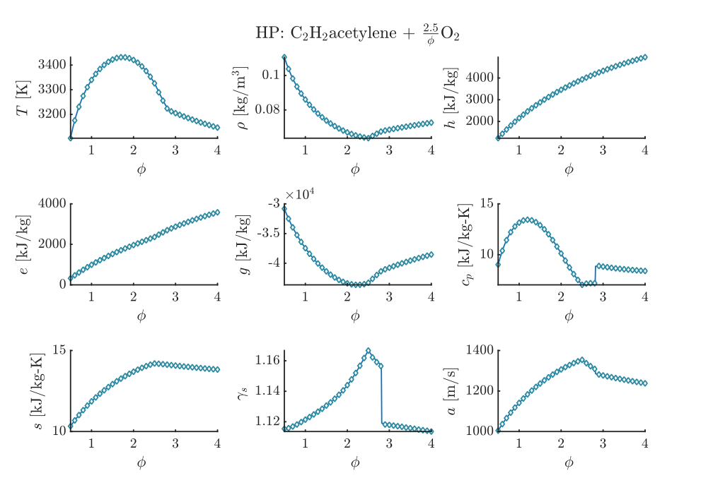

# Validations
 
A set of the results obtained using Combustion Toolbox, [CEA-NASA](https://cearun.grc.nasa.gov/), [CANTERA](https://cantera.org/) & [SD-Toolbox](https://shepherd.caltech.edu/EDL/PublicResources/sdt/)<sup>1</sup>, and [TEA](https://github.com/dzesmin/TEA).

<sup>1</sup> The Shock & Detonation Toolbox uses the Cantera software package as kernel for the thermochemical calculations.

***
**_For the sake of clarity, we only show a reduced set of species in the validation of the mole fractions._**
To run all the validations contrasted with CEA at once, at the prompt type:
```matlab
>> run_validations_CEA
```
## Validation TP 1

* Contrasted with: NASA's Chemical Equilibrium with Applications software
* Problem type: Equilibrium composition at defined T and p
* Temperature [K]   = 2500
* Pressure    [bar] = 1
* Initial mixture [moles]: $\text{C}_6\text{H}_6 + \frac{7.5}{\phi}\left(3.76 \text{N}_2 + \text{O}_2\right)$, with equivalence ratio $\phi \in [0.5, 4]$
* List of species considered = `list_species('Soot formation Extended')`
* URL Folder Results CEA: ./validations/cea/data/tp

To repeat the results, run:
```matlab
>> run_validation_TP_CEA_1.m
```

<p align="center">
    
    
</p>

## Validation TP 2

* Contrasted with: NASA's Chemical Equilibrium with Applications software
* Problem type: Equilibrium composition at defined T and p
* Temperature [K]   = 2500
* Pressure    [bar] = 1
* Initial mixture [moles]: $\text{C}_6\text{H}_6 + \frac{7.5}{\phi} \text{O}_2$, with equivalence ratio $\phi \in [0.5, 4]$
* List of species considered = `list_species('Soot formation Extended')`
* URL Folder Results CEA: ./validations/cea/data/tp

To repeat the results, run:
```matlab
>> run_validation_TP_CEA_2.m
```

<p align="center">
    
    
</p>

## Validation TP 3

* Contrasted with: NASA's Chemical Equilibrium with Applications software
* Problem type: Equilibrium composition at defined T and p
* Temperature [K]   = 2500
* Pressure    [bar] = 1
* Initial mixture [moles]: $\text{C}\text{H}_3\text{OH} + \frac{1.5}{\phi}\left(3.76 \text{N}_2 + \text{O}_2\right)$, with equivalence ratio $\phi \in [0.5, 4]$
* List of species considered = `list_species('Soot formation Extended')`
* URL Folder Results CEA: ./validations/cea/data/tp

To repeat the results, run:
```matlab
>> run_validation_TP_CEA_3.m
```

<p align="center">
    
    
</p>

## Validation TP 4

* Contrasted with: NASA's Chemical Equilibrium with Applications software
* Problem type: Equilibrium composition at defined T and p
* Temperature [K]   = 2500
* Pressure    [bar] = 1
* Initial mixture [moles]: $\text{C}\text{H}_3\text{OH} + \frac{1.5}{\phi}\text{O}_2$, with equivalence ratio $\phi \in [0.5, 4]$
* List of species considered = `list_species('Soot formation Extended')`
* URL Folder Results CEA: ./validations/cea/data/tp

To repeat the results, run:
```matlab
>> run_validation_TP_CEA_4.m
```

<p align="center">
    
    
</p>

## Validation HP 1

* Contrasted with: NASA's Chemical Equilibrium with Applications software
* Problem type: Adiabatic T and composition at constant p
* Temperature [K]   = 300
* Pressure    [bar] = 1
* Initial mixture [moles]: $\text{C}_2\text{H}_2\text{acetylene} + \frac{2.5}{\phi}\left(3.76 \text{N}_2 + \text{O}_2\right)$, with equivalence ratio $\phi \in [0.5, 4]$
* List of species considered = `list_species('Soot formation Extended')`
* URL Folder Results CEA: ./validations/cea/data/hp

To repeat the results, run:
```matlab
>> run_validation_HP_CEA_1.m
```

<p align="center">
    
    
</p>

## Validation HP 2

* Contrasted with: NASA's Chemical Equilibrium with Applications software
* Problem type: Adiabatic T and composition at constant p
* Temperature [K]   = 300
* Pressure    [bar] = 1
* Initial mixture [moles]: $\text{C}_2\text{H}_2\text{acetylene} + \frac{2.5}{\phi}\text{O}_2$, with equivalence ratio $\phi \in [0.5, 4]$
* List of species considered = `list_species('Soot formation Extended')`
* URL Folder Results CEA: ./validations/cea/data/hp

To repeat the results, run:
```matlab
>> run_validation_HP_CEA_2.m
```

<p align="center">
    
    
</p>

## Validation HP 3

* Contrasted with: NASA's Chemical Equilibrium with Applications software
* Problem type: Adiabatic T and composition at constant p
* Temperature [K]   = 300
* Pressure    [bar] = 1
* Initial mixture [moles]: $\text{C}\text{H}_4 + \frac{2}{\phi}\left(3.76 \text{N}_2 + \text{O}_2\right)$, with equivalence ratio $\phi \in [0.5, 4]$
* List of species considered = `list_species('Soot formation Extended')`
* URL Folder Results CEA: ./validations/cea/data/hp

To repeat the results, run:
```matlab
>> run_validation_HP_CEA_3.m
```

<p align="center">
    
    
</p>

## Validation HP 4

* Contrasted with: NASA's Chemical Equilibrium with Applications software
* Problem type: Adiabatic T and composition at constant p
* Temperature [K]   = 300
* Pressure    [bar] = 1
* Initial mixture [moles]: $\text{C}\text{H}_4 + \frac{2}{\phi}\text{O}_2$, with equivalence ratio $\phi \in [0.5, 4]$
* List of species considered = `list_species('Soot formation Extended')`
* URL Folder Results CEA: ./validations/cea/data/hp

To repeat the results, run:
```matlab
>> run_validation_HP_CEA_4.m
```

<p align="center">
    
    
</p>

## Validation TV 1

* Contrasted with: NASA's Chemical Equilibrium with Applications software
* Problem type: Equilibrium composition at defined T and v
* Temperature [K]   = 3000
* Pressure    [bar] = 1.0132
* Initial mixture [moles]: $\text{C}\text{H}_4 + \frac{2}{\phi}\left(3.73 \text{N}_2 + \text{O}_2 + 0.0447\text{Ar} + 0.00152 \text{CO}_2\right)$, with equivalence ratio $\phi \in [0.5, 4]$
* List of species considered = `list_species('Soot formation Extended')`
* URL Folder Results CEA: ./validations/cea/data/tv

To repeat the results, run:
```matlab
>> run_validation_TV_CEA_1.m
```

<p align="center">
    
    
</p>

## Validation EV 1

* Contrasted with: NASA's Chemical Equilibrium with Applications software
* Problem type: Adiabatic T and composition at constant v
* Temperature [K]   = 300
* Pressure    [bar] = 1.0132
* Initial mixture [moles]: $\text{C}\text{H}_4 + \frac{2}{\phi}\left(3.73 \text{N}_2 + \text{O}_2 + 0.0447\text{Ar} + 0.00152 \text{CO}_2\right)$, with equivalence ratio $\phi \in [0.5, 4]$
* List of species considered = `list_species('Soot formation Extended')`
* URL Folder Results CEA: ./validations/cea/data/ev

To repeat the results, run:
```matlab
>> run_validation_EV_CEA_1.m
```

<p align="center">
    
    
</p>


## Validation DET 1

* Contrasted with: NASA's Chemical Equilibrium with Applications software
* Problem type: Chapman-Jouget Detonation
* Temperature [K]   = 300
* Pressure    [bar] = 1
* Initial mixture [moles]: $\text{C}_2\text{H}_2\text{acetylene} + \frac{2.5}{\phi}\left(3.76 \text{N}_2 + \text{O}_2\right)$, with equivalence ratio $\phi \in [0.5, 4]$
* List of species considered = `list_species('Soot formation Extended')`
* URL Folder Results CEA: ./validations/cea/data/hp

To repeat the results, run:
```matlab
>> run_validation_DET_CEA_1.m
```

<p align="center">
    
    
    
</p>

## Validation DET 2

* Contrasted with: NASA's Chemical Equilibrium with Applications software
* Problem type: Chapman-Jouget Detonation
* Temperature [K]   = 300
* Pressure    [bar] = 1
* Initial mixture [moles]: $\text{C}_2\text{H}_2\text{acetylene} + \frac{2.5}{\phi}\text{O}_2$, with equivalence ratio $\phi \in [0.5, 4]$
* List of species considered = `list_species('Soot formation Extended')`
* URL Folder Results CEA: ./validations/cea/data/det

To repeat the results, run:
```matlab
>> run_validation_DET_CEA_2.m
```

<p align="center">
    
    
    
</p>

## Validation DET 3

* Contrasted with: NASA's Chemical Equilibrium with Applications software
* Problem type: Chapman-Jouget Detonation
* Temperature [K]   = 300
* Pressure    [bar] = 1
* Initial mixture [moles]: $\text{C}\text{H}_4 + \frac{2}{\phi}\left(3.76 \text{N}_2 + \text{O}_2\right)$, with equivalence ratio $\phi \in [0.5, 4]$
* List of species considered = `list_species('Soot formation Extended')`
* URL Folder Results CEA: ./validations/cea/data/det

To repeat the results, run:
```matlab
>> run_validation_DET_CEA_3.m
```

<p align="center">
    
    
    
</p>

## Validation DET 4

* Contrasted with: NASA's Chemical Equilibrium with Applications software
* Problem type: Chapman-Jouget Detonation
* Temperature [K]   = 300
* Pressure    [bar] = 1
* Initial mixture [moles]: $\text{C}\text{H}_4 + \frac{2}{\phi}\text{O}_2$, with equivalence ratio $\phi \in [0.5, 4]$
* List of species considered = `list_species('Soot formation Extended')`
* URL Folder Results CEA: ./validations/cea/data/det

To repeat the results, run:
```matlab
>> run_validation_DET_CEA_4.m
```

<p align="center">
    
    
    
</p>

## Validation SHOCK IONIZATION 1

* Contrasted with: NASA's Chemical Equilibrium with Applications software
* Problem type: Shock incident
* Temperature [K]   = 300
* Pressure    [bar] = 1
* Initial mixture [moles]: $3.7276 \text{N}_2 + \text{O}_2 + 0.0447\text{Ar} + 0.00152 \text{CO}_2$
* List of species considered = list_species('Air_ions')
* URL Folder Results CEA: ./validations/cea/data/shocks

To repeat the results, run:
```matlab
>> run_validation_SHOCK_IONIZATION_CEA_1.m
```

<p align="center">
    
    
</p>

## Validation SHOCK REFLECTED IONIZATION 1

* Contrasted with: NASA's Chemical Equilibrium with Applications software
* Problem type: Shock reflected
* Temperature [K]   = 300
* Pressure    [bar] = 1
* Initial mixture [moles]: $3.7276 \text{N}_2 + \text{O}_2 + 0.0447\text{Ar} + 0.00152 \text{CO}_2$
* List of species considered = `list_species('Air_ions')`
* URL Folder Results CEA: ./validations/cea/data/shocks

To repeat the results, run:
```matlab
>> run_validation_SHOCK_R_IONIZATION_CEA_1.m
```

<p align="center">
    
    
</p>

## Validation SHOCK POLAR 1

* Contrasted with: Caltech's SD Toolbox and CANTERA
* Problem type: Shock Polar
* Temperature [K]   = 300
* Pressure    [bar] = 1.01325
* Initial mixture [moles]: $3.7619 \text{N}_2 + \text{O}_2$
* List of species considered = Frozen
* URL Folder Results SDToolbox: ./validations/sdtoolbox/data

To repeat the results, run:
```matlab
>> run_validation_SHOCK_POLAR_SDToolbox_1.m
```

<p align="center">
    
    
</p>

## Validation ROCKET 1

* Contrasted with: NASA's Chemical Equilibrium with Applications software
* Problem type: ROCKET
* Description: Equilibrium composition at exit of the rocket nozzle
* Temperature Fuel [K] = 298.15
* Temperature Oxid [K] = 90.17
* Chamber pressure [bar] = 22
* Finite-Area-Chamber model (FAC)
* Area ratio $A_{\rm chamber} / A_{\rm throat}$ = 2
* Area ratio $A_{\rm exit} / A_{\rm throat}$ = [1:2.6]
* Initial mixture [moles]: $\text{RP1} + \frac{0.6723}{\phi}\text{LOX}$
* List of species considered = HC/O2/N2 PROPELLANTS
* URL Folder Results CEA: ./validations/cea/rocket

To repeat the results, run:
```matlab
>> run_validation_ROCKET_CEA_1.m
>> run_validation_ROCKET_CEA_16.m
```

<p align="center">
    
</p>

## Validation ROCKET 2

* Contrasted with: NASA's Chemical Equilibrium with Applications software
* Problem type: ROCKET
* Description: Equilibrium composition and performance parameters at exit of the rocket nozzle
* Temperature Fuel [K] = 20.27
* Temperature Oxid [K] = 90.17
* Chamber pressure [bar] = 22
* Infinite-Area-Chamber model (IAC)
* Area ratio $A_{\rm exit} / A_{\rm throat}$ = 3
* Initial mixture [moles]: $\text{LH2} + \frac{0.5}{\phi}\text{LOX}$
* List of species considered = HYDROGEN_L
* URL Folder Results CEA: ./validations/cea/rocket

To repeat the results, run:
```matlab
>> run_validation_ROCKET_CEA_17.m
```

<p align="center">
    
    
    
    
</p>

## Validation ROCKET 3

* Contrasted with: NASA's Chemical Equilibrium with Applications software
* Problem type: ROCKET
* Description: Equilibrium composition and performance parameters at exit of the rocket nozzle
* Temperature Fuel [K] = 20.27
* Temperature Oxid [K] = 90.17
* Chamber pressure [bar] = 22
* Finite-Area-Chamber model (FAC)
* Area ratio $A_{\rm chamber} / A_{\rm throat}$ = 2
* Area ratio $A_{\rm exit} / A_{\rm throat}$ = 3
* Initial mixture [moles]: $\text{LH2} + \frac{0.5}{\phi}\text{LOX}$
* List of species considered = HYDROGEN_L
* URL Folder Results CEA: ./validations/cea/rocket

To repeat the results, run:
```matlab
>> run_validation_ROCKET_CEA_18.m
```

<p align="center">
    
    
    
    
</p>

## Validation TEA 1
* Contrasted with: Thermochemical Equilibrium Abundances of chemical species software
* Problem type: Equilibrium composition at defined T and p
* Temperature [K]   = linspace(500, 5000)
* Pressure    [bar] = logspace(-5, 2)
* Initial mixture [moles]:
  + H  = 1.0000000000e+00
  + He = 8.5113803820e-02
  + C  = 2.6915348039e-04
  + N  = 6.7608297539e-05
  + O  = 4.8977881937e-04
* List of species considered = {'C', 'CH4', 'CO2', 'CO', 'H2', 'H', 'H2O', 'He', 'N2', 'N', 'NH3', 'O'}
* URL Results TEA: [https://github.com/dzesmin/TEA/blob/master/doc/examples/quick_example/results/quick_example.tea](https://github.com/dzesmin/TEA/blob/master/doc/examples/quick_example/results/quick_example.tea)

To repeat the results, run:
```matlab
>> run_validation_TP_TEA_1.m
```

<p align="left">
    
</p> 

## Validation TEA 2
* Contrasted with: Thermochemical Equilibrium Abundances of chemical species software
* Problem type: Equilibrium composition at defined T and p
* Description: Thermochemical equilibrium vertical distribution of WASP-43b with a metallicity $\zeta = 1$ assumming a T-P profile
* Temperature [K]   = [958.36, 1811.89]
* Pressure    [bar] = [2.3988e-06, 31.6230]
* Initial mixture: Computed from solar abundances assuming a metallicity zeta = 1
* List of species considered = {'C2H2_acetylene', 'C2H4', 'C', 'CH4', 'CO2', 'CO', 'H2', 'H2O', 'H2S', 'H', 'HCN', 'He', 'SH', 'N2', 'N', 'NH3', 'O', 'S'}
* URL Results TEA: [https://github.com/dzesmin/RRC-BlecicEtal-2015a-ApJS-TEA/tree/master/Fig6/WASP43b-solar](https://github.com/dzesmin/RRC-BlecicEtal-2015a-ApJS-TEA/tree/master/Fig6/WASP43b-solar)

To repeat the results, run:
```matlab
>> run_validation_TP_TEA_2.m
```

<p align="left">
    
</p> 

## Validation TEA 3
* Contrasted with: Thermochemical Equilibrium Abundances of chemical species software
* Problem type: Equilibrium composition at defined T and p
* Description: Thermochemical equilibrium vertical distribution of WASP-43b with a metallicity $\zeta = 10$ assumming a T-P profile
* Temperature [K]   = [958.36, 1811.89]
* Pressure    [bar] = [2.3988e-06, 31.6230]
* Initial mixture: Computed from solar abundances assuming a metallicity zeta = 10
* List of species considered = {'C2H2_acetylene', 'C2H4', 'C', 'CH4', 'CO2', 'CO', 'H2', 'H2O', 'H2S', 'H', 'HCN', 'He', 'SH', 'N2', 'N', 'NH3', 'O', 'S'}
* URL Results TEA: [https://github.com/dzesmin/RRC-BlecicEtal-2015a-ApJS-TEA/tree/master/Fig6/WASP43b-10xsolar](https://github.com/dzesmin/RRC-BlecicEtal-2015a-ApJS-TEA/tree/master/Fig6/WASP43b-10xsolar)

To repeat the results, run:
```matlab
>> run_validation_TP_TEA_3.m
```

<p align="left">
    
</p> 

## Validation TEA 4
* Contrasted with: Thermochemical Equilibrium Abundances of chemical species software
* Problem type: Equilibrium composition at defined T and p
* Description: Thermochemical equilibrium vertical distribution of WASP-43b with a metallicity $\zeta = 50$ assumming a T-P profile
* Temperature [K]   = [958.36, 1811.89]
* Pressure    [bar] = [2.3988e-06, 31.6230]
* Initial mixture: Computed from solar abundances assuming a metallicity zeta = 50
* List of species considered = {'C2H2_acetylene', 'C2H4', 'C', 'CH4', 'CO2', 'CO', 'H2', 'H2O', 'H2S', 'H', 'HCN', 'He', 'SH', 'N2', 'N', 'NH3', 'O', 'S'}
* URL Results TEA: [https://github.com/dzesmin/RRC-BlecicEtal-2015a-ApJS-TEA/tree/master/Fig6/WASP43b-50xsolar](https://github.com/dzesmin/RRC-BlecicEtal-2015a-ApJS-TEA/tree/master/Fig6/WASP43b-50xsolar)

To repeat the results, run:
```matlab
>> run_validation_TP_TEA_4.m
```

<p align="left">
    
</p> 